# YouTube Research Toolkit

YouTubeの競合チャンネル分析・追跡、およびAIを用いた差別化（ポジショニング）要素の抽出を行うためのフルスタックWebアプリケーションです。

---

## 概要

新しくYouTubeチャンネルを立ち上げる際、あるいは既存チャンネルを成長させる際、競合チャンネルが「どのように成長してきたか」を定量・定性的に追跡・分析します。
収集したデータを元に、AI（Gemini API）を活用して「競合がまだカバーしていないテーマ」や「独自のポジショニング」を分析・導き出すほか、ドメインナレッジ（RAG）を用いた高度なリスク分析と PDF / 画像レポート保存機能を提供します。

---

## ✨ 主な機能

### 📊 ダッシュボード (メイン画面)
* **📉 登録者数減少チャンネルの衰退バッジ ＆ 排他コントロールフィルター (#77)**:
  * **衰退警告バッジ**: 前日比で登録者数が減少中のチャンネルにネオンローズ/レッドの危険警告バッジ (`📉 登録者 -X名`) を表示。
  * **`📉 衰退` 排他トグルボタン**: 下段コントロールバーに `[ 📉 衰退 (N) ]` フィルターボタンを追加。急成長 (`🔥`) フィルターと直感的に相互排他制御され、一瞬で衰退チャンネル一覧のみを抽出・比較可能。
* **🔥 直近1週間 (過去7日間 / 168時間) の動画投稿数可視化 (#76)**:
  * **リアルタイム正確算出**: 過去168時間以内に投稿された動画本数 (`weekly_video_count`) を動的に計算して返却。
  * **フレイムハイライト**: 競合チャンネルカードの分析メトリクスエリアに `🔥 直近7日: X本` チップを表示。投稿がある場合はフレイムオレンジで美しくハイライト。
* **🛡️ 起動時 DB 全自動バックアップ ＆ 7日ローテーション削除 ＆ リストア機能 (#75)**:
  * **オンラインホットバックアップ**: アプリ起動時 (`main.py`) に `sqlite3.backup` API でデータの整合性を保ったままオンラインバックアップを安全生成 (`youtube_research_backup_YYYYMMDD_HHMMSS.db`)。
  * **7日ローテーション**: 8日以上経過した古いバックアップファイルを自動検知して安全削除。
  * **安全リストア ＆ 緊急退避**: 復元時に現行 DB を `youtube_research_emergency_...` に自動退避してからリストアする二重保護構造。
* **🧹 ローカル JSON 書き込み廃止 ＆ GitHub Actions 更新一元化 (#74)**:
  * アプリ起動時および個別のレスキュー取得から JSON ファイルへの直書き込みを削除し、手動コミットの手間と `git status` の汚れを100%排除。
* **🏆 登録者達成マイルストーン一覧機能 (#46, #50)**:
  * **最上部ナビボタン**: 最上部メインナビゲーションタブのすぐ隣に「🏆 達成マイルストーン」ボタンを設置。
  * **到達日 ＆ 成長スピード分析**: 競合チャンネルが登録者数 **1,000人 (1K)**、**10,000人 (10K)**、**100,000人 (100K)** に到達した日付と、到達にかかった経過日数（開設〜1K、1K〜10K、10K〜100K）をモーダルで一覧表示。
  * **多角ソート ＆ 検索**: 「10万人達成日順」「1万人達成日順」「1K➔10K成長スピード順」での並び替えやリアルタイムキーワード検索。
* **⚠️ 当日データ未取得警告 ＆ 起動時全自動補填レスキュー機能 (#45, #47, #52)**:
  * **未取得自動検知バナー**: 当日 (JST) の時系列データが未取得のチャンネルが存在する場合、ダッシュボード上部に警告バナーを自動表示 (`🟢 全件同期完了` / `⚠️ 本日のデータ未取得あり`)。
  * **🛡️ 起動時全自動レスキュー補填 (#52)**: アプリ起動時に本日分のデータ未取得チャンネルが存在する場合、サーバー起動時に裏側で全自動で YouTube API からデータを取得して DB に即座に自動補填・保存。
  * **🔄 ワンクリック即時フェッチ**: 「今すぐデータを取得」ボタンで画面から直接手動補填・DB保存可能。
* **🔥 2大急成長注目シグナルバッジ ＆ ワンタップ急成長トグル (#36, #51, #55)**:
  * **登録者数急増**: 前日比で登録者数が **+100名以上** 急増中のチャンネルにバッジ表示 (`🔥 登録者 +XXX名`)。
  * **総再生数急増 (#51)**: 前日比で総再生数が **+2.0% 以上** 急増中のチャンネルにバッジ表示 (`🔥 再生数 +X.X%`)。
  * **`🔥 急成長のみ` ネオントグルボタン (#55)**: 下段コントロールバーにワンタップ絞り込みトグルを設置。注目チャンネルのみを一瞬で抽出。
* **🩳 Shorts / 🔴 LIVE / 🎬 通常動画の頻度 ＆ 割合可視化機能 (#56, #57)**:
  * **3色プログレスバー ＆ フォーマットバッジ**: 各競合チャンネルカードの平均再生数エリアに **`🩳 Shorts XX%` `🔴 LIVE XX%` `🎬 通常 XX%`** の内訳とプログレスバーを表示。
* **🛡️ 米国IP地域除外対策 (`hl="ja"`) ＆ ハンドル名自動二重フォールバック (#54)**:
  * **`hl="ja"` 明示**: GitHub Actions (米国IP) からの地域限定チャンネルの自動除外・漏れを回避。
  * **二重フォールバック**: チャンネルID一括取得 ➔ ID個別取得 ➔ ハンドル名 (`forHandle="@..."`) 個別取得の3段階補正により100%確実な自動取得を実現。
* **📈 視覚的一体化トレンド制御グループ (#43, #44, #50)**:
  * **一体化グループコントロール**: 「📈 トレンド一括表示 ⇄ 📉 一括閉じる」ボタンと「📊 指標選択ドロップダウン」を1つのペアグループとして統合。
* **✨ 超シンプル登録フォーム ＆ 最新100件一括同期 (#49)**:
  * 競合のチャンネルID または ハンドル (`@...`) のみで一瞬で登録完了。動画同期は一律「最新100件」に自動統一。
* **登録者数規模に応じたランク別グラデーションカード**:
  * 💎 **Diamond** (10万人〜) / 🥇 **Gold** (1万人〜) / 🥈 **Silver** (1,000人〜) / 🥉 **Bronze** (< 1,000人)
* **🔍 リアルタイム・キーワード検索 ＆ 規模ランク切り替えチップ (#40)**:
  * `すべて` / `💎 10万+` / `🥇 1万+` / `🥈 1千+` / `🥉 1千未満` / `📌 ピン留め` / `🔥 急成長` / `📉 衰退` のワンタップ切り替え。
* **🔃 インタラクティブな多角ソート機能 (#34)**:
  * 「カスタム順 (手動ドラッグ順)」「登録者数順」「総再生数順」「動画数順」「平均再生数順」の優先配置ソート。

---

### 📈 成長率比較分析画面 (#28, #35, #42, #48, #61)
* **🥉 1千未満 (`under1k`) ワンタップ一括選択ボタン (#61)**:
  * 左サイドバーの規模別一括選択パネルに `🥉 1千未満` ボタンを追加。登録者数 1,000人未満の立ち上げ初期・小型競合チャンネルを一瞬で全選択・比較表示。
* **🏆 直近累積成長率 (%) Top 5 / Top 10 自動選択機能 (#48)**:
  * 左サイドバーに **`🏆 成長率 Top 5`** および **`🔥 Top 10`** ワンタップボタンを新設。
* **累積成長率 (%) 比較 2連並列グラフ**:
  * 追跡開始日を `0.0%` とした累積成長率 (%) を算出・可視化（上段: 登録者数 / 下段: 総再生数）。
* **🔍 左サイドバー文字列検索フィルター (#42)**:
  * チャンネル名やハンドル名（`@...`）の入力で比較対象リストをリアルタイム抽出。

---

### 📊 時系列トレンド ＆ リッチなインタラクティブ機能 (#56, #59, #60, #62)
* **💡 前日比 (DoD) ＆ 前週比 (WoW) インタラクティブバッジツールチップ (#62)**:
  * トレンドグラフのマウスホバー（`CustomTooltip`）時に、選択中メトリクスの「前日比 (増減数 ＆ 増減率%)」と「前週比 (7日前比較の増減数 ＆ 増減率%)」を **ネオングリーン (`#00ff7f`)** / **ネオンレッド (`#ff4d4d`)** の高コントラストバッジで視覚的にリアルタイム表示。

---

### 🤖 ディレクトリ型 RAG ナレッジ拡張 ＆ AIポジショニング分析 (#37, #49, #77, #78)
* **📚 ディレクトリ型 RAG ナレッジ管理システム (`backend/data/knowledge/`) (#78)**:
  * 今後ナレッジを自由に追加・改修できるよう、`backend/data/knowledge/` 配下に `.md` や `.txt` ファイルを置くだけで、**コードの改修一切なしで即座に RAG ナレッジとして Gemini AI に自動認識・昇順ソート連結・反映される拡張構造**を構築。
  * **`01_bgm_domain_knowledge.md`**: BGM・作業用コンテンツ専門戦略ガイドライン。
  * **`02_zero_to_100_growth_strategy.md`**: 【新規追加】登録者100人までの到達目標・期間目安（2〜3ヶ月/10〜20本）、認知度・信頼感向上の本質要因、ペルソナ極限絞り込み、資産テーマのリサーチ、数字だけの登録者排除、勝ちパターンの確立戦略。
* **🌱 登録者100人未満チャンネルへの動的プロンプト強調 (`early_stage_instruction`) (#78)**:
  * 分析対象チャンネル（または自チャンネル）の登録者数が 100人未満の場合、初期立ち上げナレッジを優先参照し、検索インテント(SEO)重視・ペルソナ絞り込み・勝ちパターン確立のアドバイスを出力するようにプロンプトを自動拡張。
* **⚠️ 衰退要因 ＆ 反面教師アドバイス出力 (`decline_reason_analysis`) (#77)**:
  * 登録者数が減少中のチャンネルを AI 分析する際、登録者離脱の要因分析と「自チャンネルが真似してはならない反面教師の教訓」を `AIAnalysisModal` 内のアラートカードとしてレンダリング。
* **Gemini API 構造化出力 (Structured Outputs)**:
  * 競合の「強み」「弱み」「ヒットテーマ」「差別化・ポジショニング戦略アドバイス」を精密に抽出・レポート出力。
* **📄 PDF ＆ 🖼️ 高画質画像 (PNG/SVG) 保存・ダウンロード機能 (#37)**:
  * `html2canvas` + `jspdf` による高解像度 (`scale: 2`) レポートローカル保存。

---

## 技術スタック

* **フロントエンド**: Next.js 14 (App Router) + TypeScript + Recharts (データ可視化) + Lucide React + html2canvas + jspdf + Vanilla CSS (CSS Modules)
* **バックエンド**: FastAPI (Python 3.12) + SQLAlchemy + SQLite (ローカルデータベース)
* **AI・外部API**: YouTube Data API v3, Gemini API (`google-genai` SDK / Structured Outputs)
* **自動収集バッチ**: GitHub Actions (日次自動フェッチ) + CLI python バッチ

---

## プロジェクト構成

```text
youtube-research-toolkit/
├── .github/                  # GitHub Actions ワークフロー定義
│   └── workflows/
│       └── fetch_stats.yml   # 日次統計データ自動収集バッチ定義 (日本時間 午前10:00 JST 実行)
├── backend/                  # FastAPI バックエンド
│   ├── app/                  # アプリケーションロジック
│   │   ├── api/endpoints/    # APIルート (channels.py, comparison.py)
│   │   ├── core/             # 設定ファイル (config.py : DATABASE_URL 絶対パス固定)
│   │   ├── data/             # ナレッジファイル (domain_knowledge.txt) & 時系列JSON
│   │   ├── models/           # DBモデル (channel, video, channel_stats_history)
│   │   ├── schemas/          # Pydantic スキーマ
│   │   └── services/         # YouTube API (1リクエスト一括フェッチ対応) & Gemini API 連携サービス
│   ├── main.py               # API エントリーポイント (起動時自動レスキュー補填対応)
│   └── requirements.txt      # 依存ライブラリ一覧
├── frontend/                 # Next.js フロントエンド
│   ├── src/app/
│   │   ├── components/       # UIコンポーネント (ChannelCard, GrowthComparisonView, AIAnalysisModal, MilestoneModal)
│   │   ├── utils/            # API通信関数 (api.ts)
│   │   └── page.tsx          # メインページ (タブ切替・ソートコントロール)
│   └── package.json          # 依存パッケージ一覧
└── README.md                 # 本ドキュメント
```

---

## セットアップ方法

### 必要な環境変数
`backend/.env` ファイルを作成し、以下のキーを設定してください。

```env
# YouTube Data API キー
YOUTUBE_API_KEY=your_youtube_api_key_here

# Gemini API キー (AI分析用)
GEMINI_API_KEY=your_gemini_api_key_here
```

### 1. バックエンド (FastAPI) の起動

```bash
cd backend
source venv/bin/activate  # macOS/Linux
pip install -r requirements.txt
uvicorn main:app --reload --port 8001
```
[http://localhost:8001/docs](http://localhost:8001/docs) で API Swagger UI にアクセスできます。

### 2. フロントエンド (Next.js) の起動

```bash
cd frontend
npm install
npm run dev
```
[http://localhost:3000](http://localhost:3000) でダッシュボード画面にアクセスできます。

---

## 🔄 データ取得・自動レスキュー構成アーキテクチャ

本システムにおける「日次自動バッチ」「起動時全自動レスキュー」「画面手動取得」のデータフロー全体図です。

```mermaid
flowchart TD
    subgraph Remote["1. リモート自動バッチ (GitHub Actions)"]
        Cron["⏰ 毎日 10:00 JST 起動"] --> GHA_Fetch["fetch_stats.py --json\n(全26チャンネル一括フェッチ)"]
        GHA_Fetch --> GHA_JSON["backend/data/history/{cid}.json\nへ自動保存"]
        GHA_JSON --> Git_Push["git commit & push\n(リポジトリへ自動更新)"]
    end

    subgraph LocalApp["2. ローカルアプリ起動時 (FastAPI 起動)"]
        User_Start["🚀 uvicorn main:app 起動"] --> Git_Pull["git pull (最新JSONを取得)"]
        Git_Pull --> Sync_DB["run_sync_json_mode()\nJSON履歴 ➔ SQLite DBへマージ"]
        Sync_DB --> Rescue_Check{"本日(JST)未取得の\nチャンネルが存在するか？"}
        
        Rescue_Check -- "YES (未取得あり)" --> Auto_Rescue["🛡️ ensure_today_stats_rescued()\n(日本国内IPからYouTube API即時レスキュー)"]
        Auto_Rescue --> Save_Both["SQLite DB ＆ JSON履歴の\n両方に自動補填・保存"]
        
        Rescue_Check -- "NO (全件同期済み)" --> Ready["🟢 全件同期完了 (ダッシュボード表示)"]
        Save_Both --> Ready
    end

    subgraph Manual["3. 画面UIからの手動フェッチ"]
        Btn["🔄 「今すぐデータを取得」ボタン"] --> Fetch_All["POST /api/channels/fetch-all-stats"]
        Fetch_All --> Direct_API["YouTube API 直接フェッチ (日本IP)"]
        Direct_API --> UI_Save["SQLite DB ＆ JSON履歴を即時更新"]
    end
```



---

## 時系列データの自動収集と同期 (GitHub Actions)

PCが起動していなくても、毎日自動的（日本時間 午前10:00 JST / YouTube日次集計確定後の安全時間帯）に競合チャンネルの数値（登録者、再生数、動画数）を収集・蓄積する仕組みを搭載しています。

* **`YOUTUBE_API_KEY` (Secrets)**: YouTube Data API キー（※設定必須）
* **全自動チャンネル検出 (`data/history/*.json`)**:
  * リポジトリ内の `backend/data/history/*.json` ファイル一覧から対象チャンネルを100%全自動検出します。
  * 25チャンネルの最新統計データを **たった1回の API リクエストで一括高速取得** (`get_channels_info_batch`) し、通信成功率100%を維持します。
  * アプリ上で新しいチャンネルを追加・コミットするだけで、GitHub Secrets を手動更新することなく完全自動で日次自動追跡が開始されます。

---

## 💡 日次運用・Git同期ガイドライン

日常的なアプリ利用における `git pull` およびデータ同期のおすすめ運用ルールです。

### 1. おすすめのデイリー運用ルール
* **基本ルール (アプリ起動前)**:
  * アプリ（バックエンド）を起動する前に **`git pull`** を実行していただく運用が最もおすすめです。
  * 毎朝 10:00 (JST) に GitHub Actions が裏側で自動収集してくれた最新の時系列データをローカルに取り込み、API クォータを無駄遣いすることなく同期できます。
* **起動しない日があった場合**:
  * 数日ぶりにアプリを動かす際は `git pull` をしていただくと、過去数日分の蓄積データが一括でローカルにマージされます。
* **`git pull` をし忘れた場合**:
  * 万が一 `git pull` を忘れられても、アプリ起動時に**「起動時全自動レスキュー機能」**が動作し、本日分の未取得チャンネルを自動検知して即座に補填・保存します。

### 2. `git pull` 時にコンフリクト（衝突エラー）が発生した場合の対処
ローカルでアプリを起動した後に `git pull` を実行した際、`Your local changes to the following files would be overwritten by merge` エラーが出た場合は、以下の **1行コマンド** で安全・一瞬に最新化できます：

```bash
git restore backend/data/history/ && git pull origin main
```
ローカルの自動保存ファイルを最新状態へ安全にリセットし、GitHub Actions が取得した最新データを取り込むことができます。
