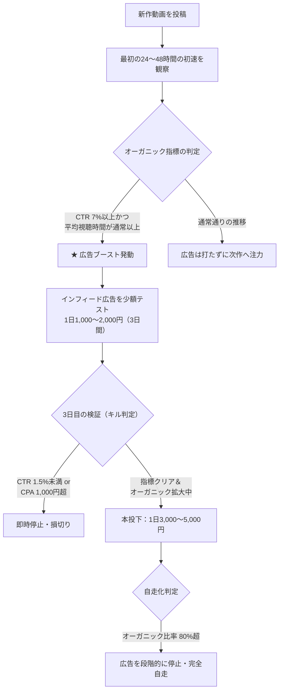

# YouTube動画広告運用・バズ動画ブースト戦略ガイド

> **Issue #98: [調査]youtubeにおける広告に関する情報をまとめたドキュメント作成する**  
> **目的**: YouTube広告の相場観・基礎知識を把握し、今後チャンネルが一定成長した段階で「バズり動画」が出た際に、適切な広告投下によってさらに再生数・登録者数をレバレッジ（ブースト）させる戦略を確立する。

---

## 1. エグゼクティブサマリー

* **動画広告の目的は「再生数を買うこと」ではない**:
  YouTube広告で単純に再生回数を買っても、アルゴリズムの評価（おすすめ表示）は上がりません。広告活用の真の目的は、**「自然に当たり始めている優秀な動画に少額の広告費を投じ、アルゴリズムの初速を加速させてオーガニック（自然流入）の巨大な波に乗せること」**です。
* **アルゴリズムが評価するのは「獲得アクション（Earned Actions）」**:
  YouTubeのレコメンドエンジンは、有料再生数そのものではなく、広告をきっかけに発生した**「他動画の自発的視聴（Earned Views）」「高評価」「チャンネル登録」「プレイリスト保存」**といった二次的オーガニック行動を強く評価します。
* **ブーストに使うべきは「インフィード動画広告」一択**:
  動画の途中に強制表示されるインストリーム広告は、視聴維持率を破壊するため厳禁。サムネイルをクリックして能動的に見てもらう「インフィード動画広告（旧TrueViewディスカバリー）」のみを使用します。
* **費用相場**:
  日本国内向けインフィード広告の場合、**1再生あたり 3〜10円**、**チャンネル登録1人あたり 150〜500円**が相場です。海外（英語圏）や国ごとの単価差を理解したターゲティングが成否を分けます。

---

## 2. YouTube広告フォーマットの比較と選定

YouTubeには複数の広告枠がありますが、チャンネル成長やバズ動画のブーストに使えるフォーマットは限られています。

| フォーマット | 掲載場所 | 課金方式 | チャンネル成長・ブースト適性 | 特徴と評価 |
| :--- | :--- | :--- | :--- | :--- |
| **インフィード動画広告** *(旧 TrueView ディスカバリー)* | 検索結果、関連動画横、ホームフィード | CPV（クリック・視聴課金） | **最適（◎ 推奨）** | サムネイルとタイトルが表示され、ユーザーが**自発的にクリックして視聴**する。視聴意欲が高く、チャンネル登録や他動画への回遊につながりやすい。 |
| **スキップ可能なインストリーム広告** | 他の動画の前後・再生中（5秒後スキップ可） | CPV（30秒以上視聴で課金） | **不適（× 厳禁）** | 強制割り込み型のため、ユーザーはスキップを狙う。視聴維持率が極端に悪化し、登録率も極めて低い。BGMジャンルでは逆効果。 |
| **バンパー広告 / スキップ不可広告** | 動画の前後・再生中（6秒〜15秒） | CPM（インプレッション課金） | **不適（× 対象外）** | 企業の認知獲得・ブランディング用。個人のチャンネル育成には無関係。 |
| **YouTube Shorts 広告** | ショートフィードの動画間 | CPM / CPV | **△（現状は実験的）** | ショート動画の露出には使えるが、長尺動画（BGM等）への誘導効率は低い。 |

> [!IMPORTANT]
> **ブースト施策では「インフィード動画広告」のみを採用してください。**  
> YouTube Studio内の「プロモーション」機能を使った場合も、自動的にインフィード形式で配信されます。

---

## 3. 広告運用の相場観・主要KPI

YouTube広告（インフィード広告）を運用する際の一般的な指標とコスト感です。

### 3.1 主要指標の定義
* **CPV (Cost Per View / 視聴単価)**: 1回クリックされて再生が始まった際にかかる費用。
* **CTR (Click Through Rate / クリック率)**: 広告サムネイルが表示された回数に対し、クリックされた割合。
* **CPA (Cost Per Action / 登録獲得単価)**: チャンネル登録者を1人獲得するのにかかった広告費。
* **CVR (Conversion Rate / 登録転換率)**: 広告経由の再生回数のうち、登録に至った割合。
* **Earned Views (獲得した視聴回数)**: 広告視聴をきっかけに、ユーザーがチャンネル内の**他の動画を自発的に再生した回数**（追加費用なし）。

### 3.2 地域別のコスト相場（インフィード広告）

| 配信ターゲット地域 | 平均 CPV (1再生) | 平均 CTR | 平均 CVR (登録率) | 推定 CPA (登録1人) | 特徴 |
| :--- | :--- | :--- | :--- | :--- | :--- |
| **日本国内** | 3円 〜 10円 | 1.5% 〜 4.0% | 1.0% 〜 3.0% | 200円 〜 600円 | 単価は高いが、視聴維持率が高く熱心なファンになりやすい。アドセンス単価（RPM）も維持される。 |
| **英語圏Tier 1** *(米国・英国・豪・加)* | 4円 〜 12円 | 1.2% 〜 3.5% | 1.0% 〜 2.5% | 300円 〜 800円 | 世界最大の市場。アドセンスRPMが最も高いが、競合も多く単価は高め。 |
| **英語圏/グローバルTier 2** *(欧州、中南米一部)* | 1円 〜 4円 | 2.0% 〜 4.5% | 1.5% 〜 3.5% | 50円 〜 200円 | コスパと質のバランスが良い。 |
| **超低単価国** *(インド・東南アジア・アフリカ等)* | 0.1円 〜 0.5円 | 3.0% 〜 6.0% | 2.0% 〜 5.0% | 5円 〜 20円 | 登録者数だけを格安で増やせるが、その後の動画が見られず、チャンネルのRPMを著しく下げるリスクあり。 |

> [!TIP]
> **作業用BGM・ノンバーバル系チャンネルの場合**:  
> 言語が不要なため「全世界」に配信したくなりますが、全地域配信にすると広告費の大半が「クリック単価の安いインドやフィリピン」に自動で流れてしまいます。  
> 配信国は**「日本、アメリカ、イギリス、ドイツ、韓国、台湾」など、購買力・RPMの高い国に限定（ホワイトリスト化）**して配信するのが鉄則です。

---

## 4. 広告出稿前の必須準備・初期設定（BGMジャンル特有の対策）

広告を打つ前に、以下の3つの設定を必ず完了させてください。

### 4.1 YouTubeチャンネルとGoogle広告アカウントのリンク
Google広告管理画面からYouTubeチャンネルを必ず連携します。
* **リンクするメリット**:
  * 広告をきっかけに発生した「獲得した登録者数（Earned Subscribers）」や「獲得した視聴回数（Earned Views）」がGoogle広告側で自動計測可能になる。
  * 「過去に動画を視聴した人」に対するリマーケティングリストが作成可能になる。
* **設定方法**: Google広告管理画面 ＞「ツールと設定」＞「リンクされたアカウント」＞「YouTube」からチャンネルを追加・承認。

### 4.2 出稿対象動画のミッドロール広告オフ（重要）
* 収益化済みチャンネルの場合、広告投下期間中は**当該動画の「ミッドロール広告（動画途中の広告）」を一時的にオフ（または開始30分以降のみ）に設定**してください。
* 自ら広告費を払って集客したユーザーが、動画開始数分でミッドロール広告に邪魔されると、作業集中の妨げとなり即離脱します。これによって視聴維持率が急落し、アルゴリズム上の評価を自ら壊してしまいます。

### 4.3 終了画面（エンドカード）と固定コメントの回遊導線
ユーザーに「この動画1本」で終わらせず、チャンネル内の他動画へ回遊（Earned Views）させるための導線を整えます。
* **終了画面**: 「公式の作業用BGMプレイリスト」および「チャンネルで最も再生されている代表作」の2枠を必ず設定。
* **固定コメント**: タイムスタンプ（トラックリスト）と、関連プレイリストのURLを最上段に配置。

---

## 5. バズり動画が出たタイミングでの「広告ブースト戦略」

### 5.1 なぜ「バズった動画」に広告を打つのか？
YouTubeアルゴリズムは、**「CTR（サムネイルクリック率）」**と**「AVD（平均視聴時間・視聴維持率）」**が高い動画を「良質なコンテンツ」とみなし、おすすめ（Browse Features）や関連動画（Suggested Videos）で無料のインプレッションを大量に付与します。

* **ダメな動画に広告を打っても無駄**: CTRや維持率が低い動画に広告を打っても、広告を止めた瞬間に再生数はゼロに戻ります。
* **バズり始めの動画に広告を打つ効果**: 既にオーガニックで高い数値を叩き出している動画に広告で「さらに質の高い初期トラフィック」を流し込むことで、**YouTube側のレコメンドエンジンに「この動画は誰に見せても受ける」という強いシグナルを送り、オーガニックの拡散スピードを倍増**させます。

### 5.2 広告投下の「トリガー条件（Go/No-Go判定）」
以下の3条件が揃った動画のみ、広告ブーストの対象とします。

1. **公開後24〜72時間の自然CTR**: **7% 〜 10% 以上**（ジャンル平均より明確に高い）
2. **平均視聴維持率**: 通常の動画の平均値を上回っていること（BGMなら15〜20分以上の滞在）
3. **自然流入の割合**: トラフィックソースの「関連動画」または「ブラウジング機能」が伸び始めていること

### 5.3 クリエイティブ・テキスト設定のコツ（インフィード広告用）

インフィード広告では「サムネイル」「見出し（最大100文字）」「説明文1・2（各最大35文字）」を設定します。

* **NG例（クリックベイト・漠然とした文）**:
  * 見出し: `神曲！絶対に集中できる最高の音楽集！`
  * 課題: 誰向けのどんなシチュエーションかが分からず、クリック後の離脱（維持率悪化）を招く。
* **OK例（シチュエーション・ベネフィット明確型）**:
  * 見出し: `【作業用BGM】深夜の集中・勉強・プログラミングが捗るLo-Fi Chill Beats`
  * 説明文1: `思考を邪魔しない心地よい環境音`
  * 説明文2: `長時間の作業・読書・睡眠のお供に`
* **ポイント**: 「用途（勉強/プログラミング/睡眠）」「音の質感（Lo-Fi/アコースティック/アンビエント）」を明示し、本当にその音を求めているユーザーだけにクリックさせることで、クリック後の視聴維持時間を最大化します。

### 5.4 運用フェーズと予算設計

#### ステップ1: 小額テスト（Day 1〜3）
* **日予算**: 1,000円 〜 2,000円 / 日（3日間で約3,000〜6,000円）
* **ターゲティング**:
  * 自チャンネルのアナリティクスで最も視聴されている国上位（例: 日本 + 米国）
  * キーワード/トピック: 関連するキーワード（例: `deep focus music`, `study with me`, `coding bgm`）
* **確認指標**:
  * 広告経由のCTRが **2.0%以上** あるか
  * 広告経由の視聴者のうち、チャンネル登録や他動画の視聴（Earned Views）が起きているか

#### ステップ2: 撤退基準（損切りライン・キルルール）
以下のいずれかに該当した場合、広告ブーストは失敗とみなし、**即座に広告を停止**して次のコンテンツ制作へ移行してください。

1. **広告CTRが 1.5% 未満（消化額1,000円時点）**:
   * サムネイルまたは広告見出しがオーディエンスに刺さっていない。
2. **登録獲得単価（CPA）が 1,000円 超、または他動画への回遊が皆無（消化額3,000円時点）**:
   * 視聴者がチャンネルのファンになっていない。
3. **オーガニック流入（ブラウジング・関連動画）の初速に全く波及が見られない（開始後72時間）**:
   * アルゴリズムの推薦エンジンが反応していない（広告単体で消費されている）。

#### ステップ3: 本投下と終了基準（エグジットライン）
* テストで手応え（登録者獲得単価が目標以内、オーガニックの伸びが加速）があれば、予算を**1日 3,000円〜5,000円**に増額。
* **エグジット基準（完全自走化）**:
  * アナリティクスのトラフィックソースで、**オーガニック（ブラウジング機能＋関連動画）の割合が全体の80%を超え、広告再生数の3〜5倍以上の自然再生が毎日生まれ始めたら、広告予算を段階的に削減（3,000円→1,500円→停止）し、オーガニックの自走に任せる**。

---

## 6. YouTubeアナリティクスでの効果測定手順

広告の効果を正しく検証するには、通常のダッシュボードではなく「詳細モード」を活用します。

1. **トラフィックソースの分離確認**:
   * YouTube Studio ＞「アナリティクス」＞「詳細モード（画面右上）」を開く。
   * ディメンションで「トラフィックソース」を選択。
   * 「YouTube 広告」と並行して、「ブラウジング機能（おすすめ）」および「関連動画」の折れ線グラフが広告開始後に右肩上がりに連動しているかを確認する。
2. **獲得指標（Earned Metrics）の確認（Google広告管理画面）**:
   * Google広告の表示項目（カラム）をカスタマイズし、「獲得した視聴回数（Earned Views）」「獲得した登録者数（Earned Subscribers）」を追加する。
   * 広告経由の直接再生だけでなく、チャンネル内の他動画がどれだけ自発的に見られたか（Earned Views比率が20%以上あるか）を健全性の指標とする。

---

## 7. 広告ブーストを行う際の注意点・落とし穴

### ① 広告経由の再生時間は「収益化条件（4,000時間）」にカウントされない
* Google広告（インフィード広告含む）を通じて直接再生された時間は、**YouTubeパートナープログラム（YPP）の収益化基準である「有効な公開動画の総再生時間4,000時間」には含まれません**。
* **ただし二次効果はある**: 広告経由でチャンネルに訪れたユーザーが、チャンネル内の「他の動画」を自発的に再生した時間や、登録後に投稿された動画を視聴した時間は、すべて4,000時間にカウントされます。

### ② アナリティクスの「平均視聴維持率」が一時的に下がる
* 広告経由で入ってきたユーザーは、検索やおすすめから来た熱心なユーザーよりも離脱が早いため、動画の「平均視聴時間」のパーセンテージが一時的に下がって見えます。
* ただし、YouTubeのアルゴリズムは**「有料広告経由のトラフィック」と「オーガニック経由のトラフィック」を内部で分離して評価**しているため、広告で維持率の平均値が下がったからといって即座にペナルティを受けるわけではありません。

### ③ 「格安国」への配信によるチャンネル毀損リスク
* 費用を浮かせようと「全世界」に配信して低単価国（インド等）の登録者を大量に集めると：
  1. 次回以降の新作動画を投稿した際、登録者のタイムラインに表示されてもクリックされない（CTR低下）。
  2. チャンネル全体のアドセンス単価（RPM）が下落し、再生されても収益が日本や欧米の1/10〜1/20になる。
* **対策**: 広告を打つ際は、必ず「自チャンネルが将来ターゲットにしたい国の言語・地域」に限定してください。

---

## 8. 出稿方法の比較：YouTube Studio「プロモーション」vs「Google 広告」

| 項目 | YouTube Studio「プロモーション」タブ | Google 広告（管理画面） |
| :--- | :--- | :--- |
| **難易度** | ★☆☆☆☆（初心者向け・最短3分） | ★★★☆☆（中級者向け・設定項目多数） |
| **出稿場所** | YouTube Studio管理画面内の「プロモーション」 | Google Ads 公式管理画面 |
| **ターゲティング精度** | 国・言語・プロモーション目的のみ | 国・言語・年齢・性別・興味関心・指定チャンネル（プレースメント）・除外設定など詳細可能 |
| **入札制御** | 自動入札のみ（単価上限設定不可） | 目標CPV上限設定可能（無駄クリックの抑制） |
| **推奨用途** | まず手軽に1回テストしてみたい時 | 本格的に無駄な費用を削り、特定のターゲット層だけにブーストをかけたい時 |

---

## 9. チェックリスト：広告ブースト実行フロー

- [ ] **1. アカウントの事前連携**
  - Google広告とYouTubeチャンネルをリンク済みか？
- [ ] **2. 出稿動画の事前調整**
  - 収益化ミッドロール広告をオフ（または30分以降）にしたか？
  - 終了画面にプレイリスト、固定コメントにリンクを設定したか？
- [ ] **3. 初速データの確認（トリガー判定）**
  - 公開後24〜48時間でオーガニックのCTRが7%以上、視聴維持率が平均以上か？
- [ ] **4. 配信設定の確認**
  - 「インフィード広告」を選択したか？（インストリームになっていないか？）
  - 配信国を日本またはターゲット主要国に絞り込んだか？（全世界配信になっていないか？）
  - 見出しと説明文に「シチュエーション・用途」を明記したか？
- [ ] **5. テスト配信とモニタリング（Day 1〜3）**
  - 1日1,000〜2,000円（上限3日間）でテスト開始したか？
  - 消化1,000円時点でCTR 1.5%以上、消化3,000円時点でCPA 1,000円以下を維持できているか？
- [ ] **6. エグジット判定**
  - トラフィックソースの80%以上が自然流入になり、自走し始めたら広告を停止したか？
